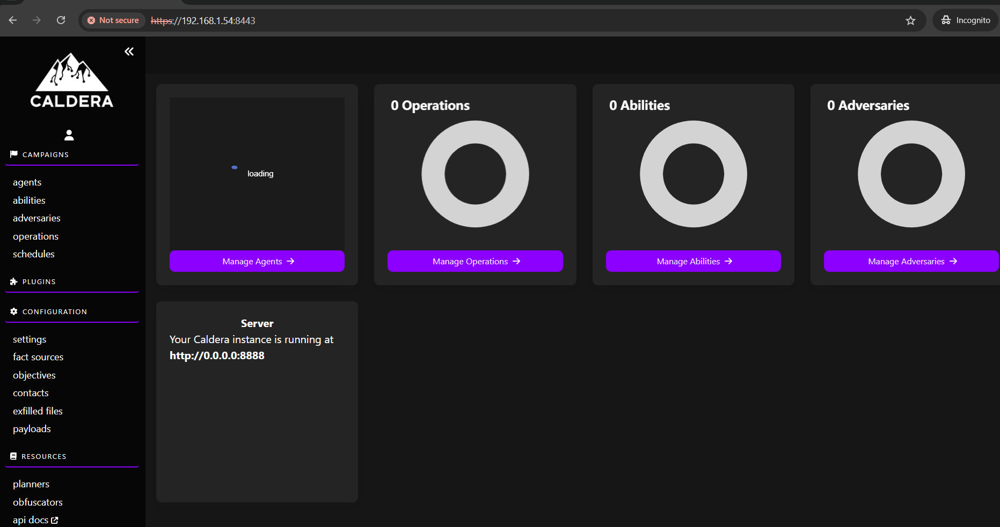

# Preliminares

El laboratorio estará basado en un Caldera desplegado sobre un servidor KaliLinux virtual.
En una primera instancia, se recomienda actualizar la plataforma hasta su última versión. Para esto:

`# sudo apt update && sudo apt upgrade -y`

Reiniciar el sistema operativo si se requiere.

Notas:
* Evaluar proposición de upgrade previo a aceptarla
* Esto es perfectamente viable en entornos de laboratorio, pero puede no serlo en entornos de producción. Evaluar factibilidad antes de actualizar en esos casos

# Instalación

## Caldera
Instalaremos Caldera a partir de clonar el proyecto directamente desde GitHub. Debemos asegurarnos de que tenemos python3 y su módulo venv instalados. Adicionalmente se requiere go-language y npm. En un entorno productivo, también es excluyente usarlo vía SSL, y para ésto también deberemos instalar haproxy.

`sudo apt install -y python3-venv golang-go nodejs npm haproxy`

Para instalar, básicamente ubicaremos el root folder de caldera /srv. Crearemos un entorno virtual de python, lo activaremos e instalaremos los requerimientos via pip.

`cd /srv`

`git clone https://github.com/mitre/caldera.git --recursive`

`cd caldera`

`python3 -m venv venv`

`source venv/bin/activate`

`pip install -r requirements.txt`

`cp conf/default.yml conf/local.yml`

## Setup SSL/TLS

Con el siguiente comando, generamos los componentes PKI necesarios
Nota: A efectos del laboratorio, el certificado será autofirmado. Esto no es recomendable para un entorno productivo

`cd /usr/share/caldera/plugins/ssl`

`sudo openssl req -x509 -newkey rsa:4096 -out conf/certificate.pem -keyout conf/certificate.pem -nodes`

OpenSSL pedirá una serie de datos. No son importantes para el entorno de laboratorio, incluso varios de ellos pueden ser dejados en blanco. El certificado quedará contenido en el directorio /usr/share/caldera/plugins/ssl/certificate.pem.

Levantaremos el servicio por primera vez, ejecutando los siguientes comandos

`python3 server.py --fresh --build`

Debería apreciarse algo como lo siguiente:

Entraremos por primera y única vez de modo inseguro, al solo efecto de habilitar el módulo ssl desde la interfaz. Apuntando el navegador a http://$IP:8888 (conteniendo la variable $IP, la ip de la máquina virtual donde se instaló caldera), deberíamos ver algo como:

Si todo anduvo según lo esperado, accediendo a http://192.168.1.54:8443, deberíamos obtener acceso a la pantalla de login de caldera

Se sugiere colocar contraseñas adecuadas en el mismo archivo de configuración, sección users. A efectos de este lab, simplemente usaremos los usuarios por defecto blue y red, con contraseña "password"

``
``
``
``
``
``
``
``
