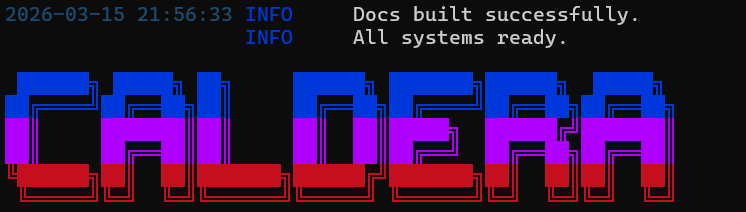
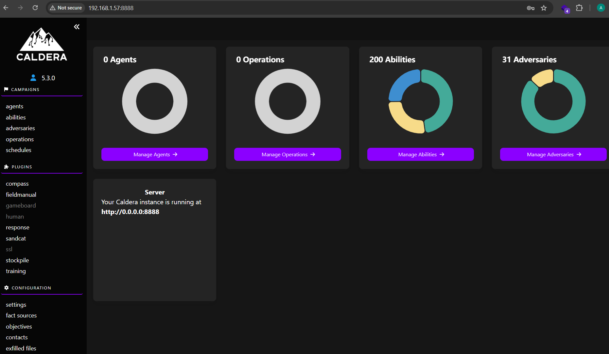
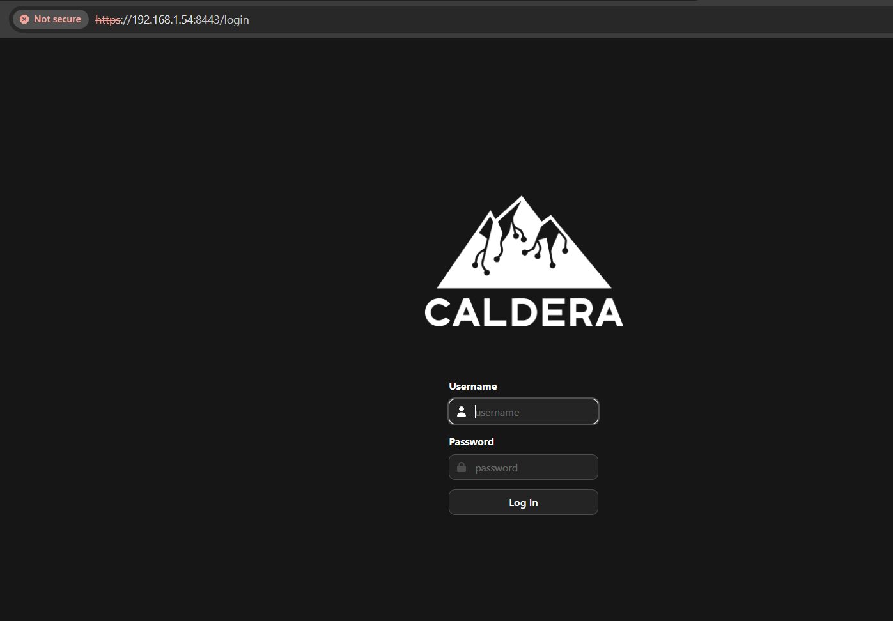

# Preliminares

El laboratorio estará basado en un Caldera desplegado sobre un servidor KaliLinux virtual.
En una primera instancia, se recomienda actualizar la plataforma hasta su última versión. Para esto:

`# sudo apt update && sudo apt upgrade -y`

Reiniciar el sistema operativo si se requiere.

Notas:
* Evaluar proposición de upgrade previo a aceptarla
* Esto es perfectamente viable en entornos de laboratorio, pero puede no serlo en entornos de producción. Evaluar factibilidad antes de actualizar en esos casos

# Instalación

## Caldera
A continuación, los pasos necesarios para realizar la instalación:

`# sudo apt install caldera`

Para corroborar la correcta instalación, ejecutar el comando caldera, con el parametro help. Debería obtenerse algo similar a lo que se expone a continuación:

Existen requerimientos adicionales si se desea usar SSL/TLS para securizar las comunicaciones, en particular, se requiere una instalación de haproxy.
NOTA: El plugin SSL usa HAProxy como proxy inverso: recibe trafico HTTPS en el puerto 8443 y lo redirige internamente al puerto 8888 de CALDERA.

## Setup SSL/TLS

`sudo apt install haproxy -y`

Con el siguiente comando, generamos los componentes PKI necesarios
Nota: A efectos del laboratorio, el certificado será autofirmado. Esto no es recomendable para un entorno productivo

`cd /usr/share/caldera/plugins/ssl`

`sudo openssl req -x509 -newkey rsa:4096 -out conf/certificate.pem -keyout conf/certificate.pem -nodes`

OpenSSL pedirá una serie de datos. No son importantes para el entorno de laboratorio, incluso varios de ellos pueden ser dejados en blanco. El certificado quedará contenido en el directorio /usr/share/caldera/plugins/ssl/certificate.pem.
Por último, copiar el template de configuración de haproxy al directorio conf

Por último, deberá activarse el plugin SSL desde la interfaz de Caldera antes del primer inicio seguro. Para ésto, editaremos el archivo configuración, buscaremos el tag "plugins" y agregaremos el plugin "ssl". Al finalizar, la sección correspondiente del archivo deberá quedar de la siguiente manera:

Si todo anduvo según lo esperado, accediendo a http://192.168.1.54:8443, deberíamos obtener acceso a la pantalla de login de caldera

``
``
``
``
``
``
``
``
